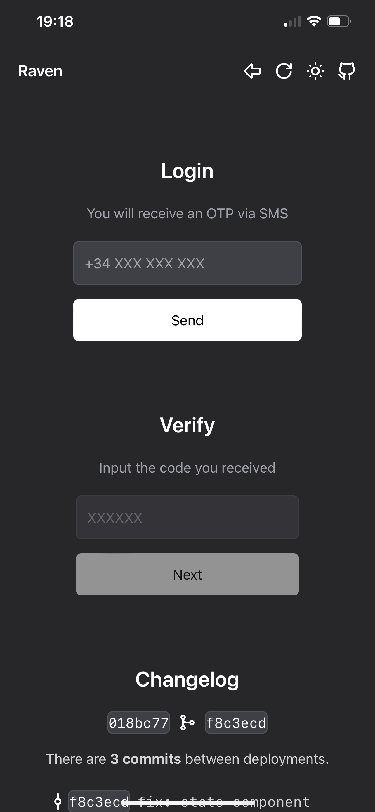
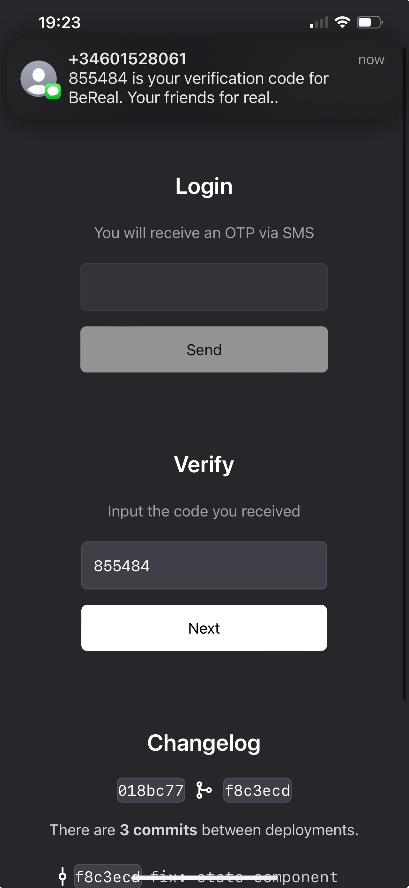
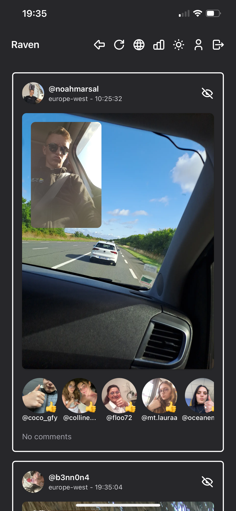
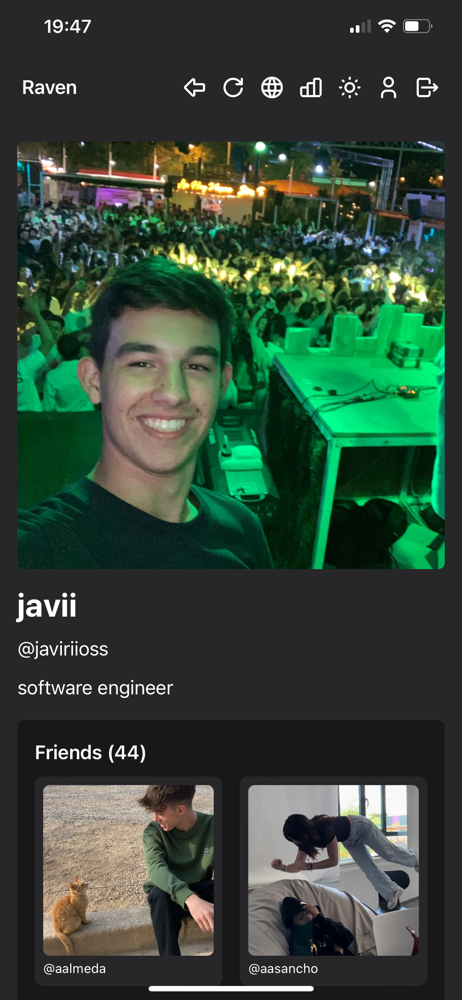
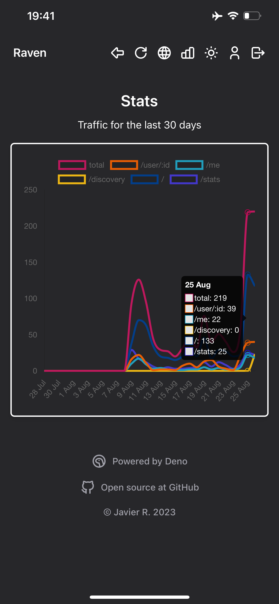

# raven

A tweaked custom [`BeReal`](https://bereal.com/) client built from the ground up
with a focus on features and performance.

# logging in

Currently, raven is hosted on [Deno Deploy](https://deno.com/deploy) at the URL
[raven.deno.dev](https://raven.deno.dev). You can use it by visiting that URL
and logging in with your BeReal account. You'll need to have a BeReal account to
use raven.

<div>
    
    
</div>

# features

- [x] see others' BeReals **without** posting your own
- [x] **screenshot** without notifying the other person
- [x] save the **original** BeReal and realMojis to your device
- [x] user **profiles** with detailed information
- [x] global feed of **recent** BeReals (removed in the official BeReal app)
- [x] worldwide **usage** statistics per route
- [x] profile tab with **all** of your friends and realMojis
- [x] **dark** and **light** mode support
- [x] **responsive** design for mobile and desktop
- [x] **fast** and **lightweight** (100 lighthouse score)

# screenshots

<div>
    
    
    
    
</div>

# development

Install deno if you haven't already:

```sh
curl -fsSL https://deno.land/x/install/install.sh | sh
```

Clone the repo:

```sh
git clone git@github.com:Jabolol/raven.git .
```

Create and fill in the `.env` file:

```sh
# GitHub API token for fetching the commit changelog
GITHUB_TOKEN=
# Google Analytics tracking ID (Optional)
GA4_MEASUREMENT_ID=
```

Run the development server:

```sh
deno task start
```

Format and lint the code before committing:

```sh
deno fmt && deno lint
```
